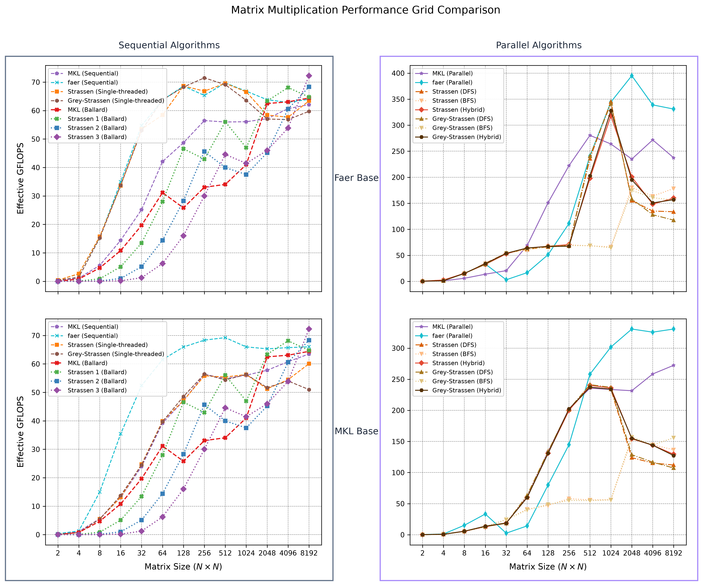
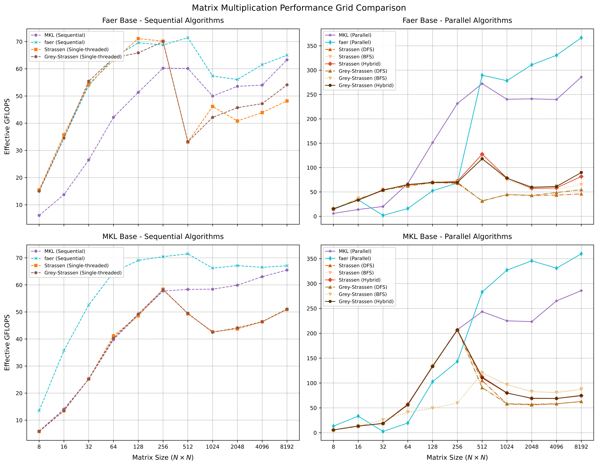
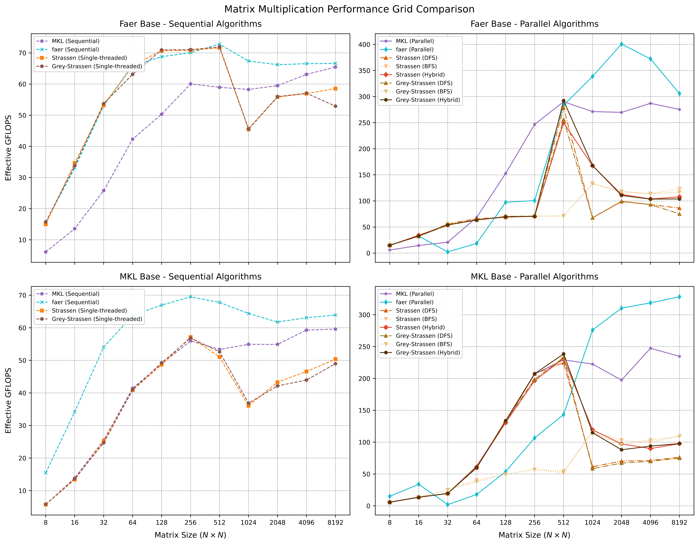
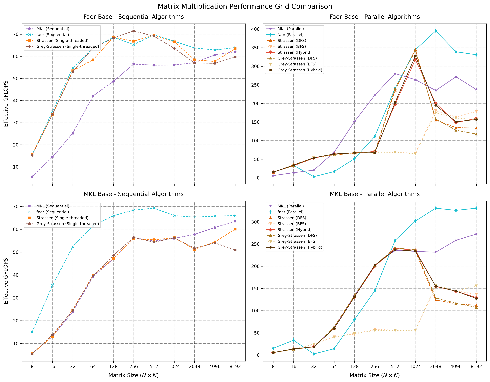

# Benchmarks results

# 30.06

Added strassen lines from Ballard et Al.

## 29.06

Remarks:

- MKL could surpass faer for bigger sizes.
- Larger fallback size to vendor library increases performance of fast
  algorithms.

### Switch to base when n<=256.

### Switch to base when n <= 512.

### Switch to base when n <= 1024.

